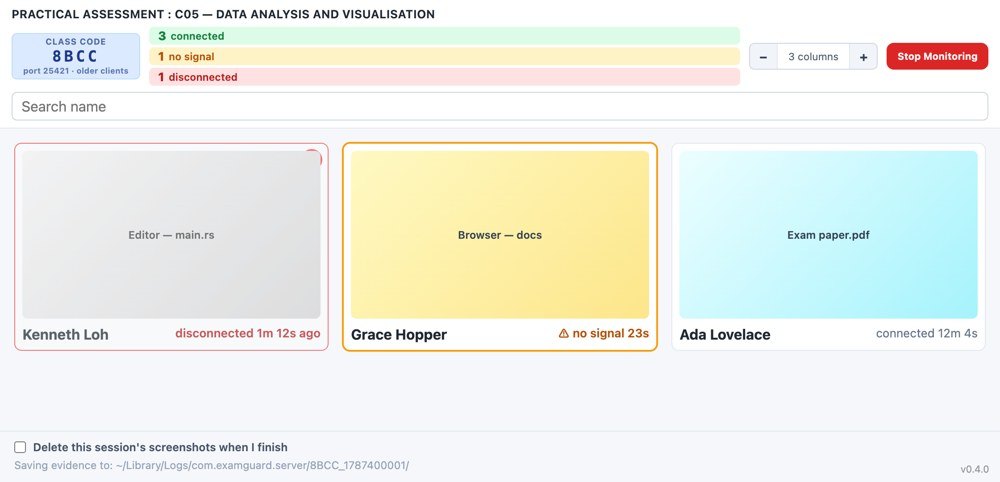
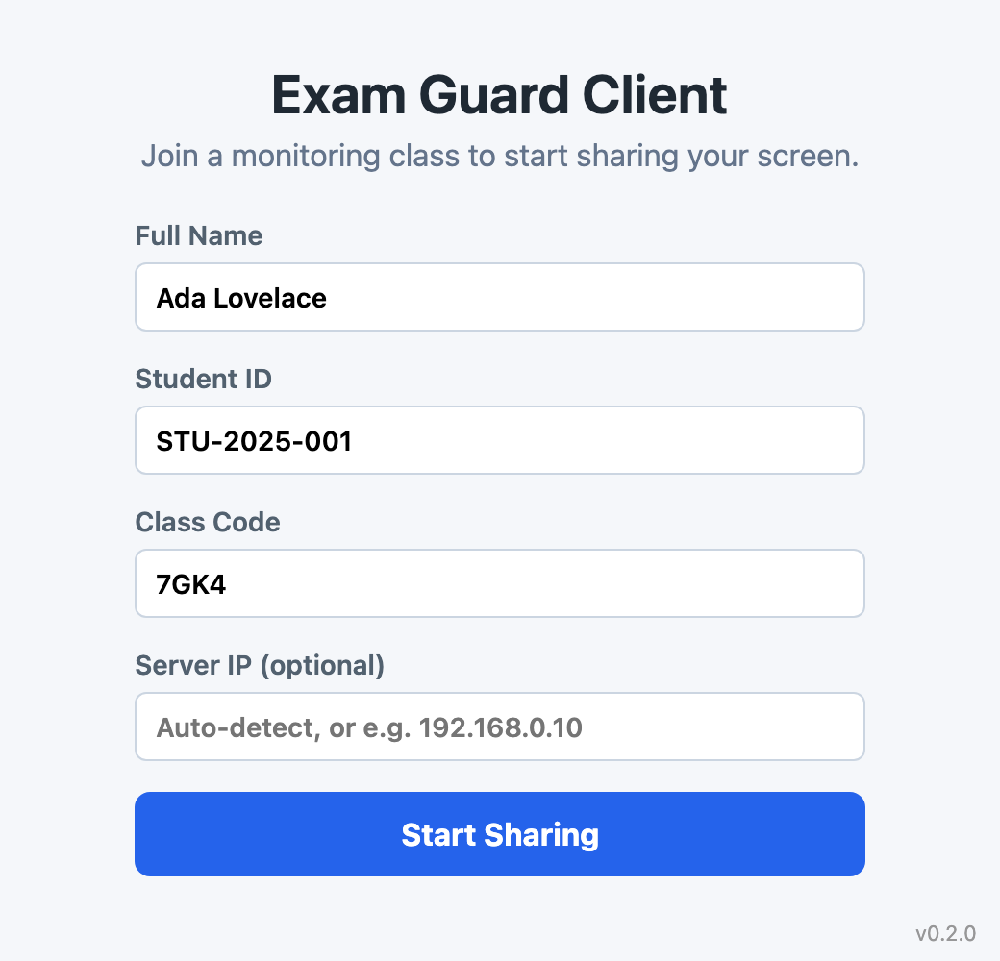

# Exam Monitor

A local-network exam proctoring tool. A **server** app on the proctor's machine
shows a live grid of every student's screen; a **client** app on each student's
machine shares their screen over the local network. No internet or accounts
required — the server and clients find each other automatically on the same
Wi-Fi/LAN.

## Two implementations

This repo contains two implementations of the same product:

| | `cross_platform/` (Tauri + Rust) | `server_monitor/` & `client_monitor/` (Swift) |
|---|---|---|
| **Status** | ✅ **Active — this is what ships** | ⚠️ Superseded prototype |
| **Platforms** | Windows, macOS, Linux | macOS only |
| **Released to GitHub** | Yes — every release | No (build locally in Xcode) |

The **Tauri app in `cross_platform/` is the product** — it is built and
published for Windows, macOS, and Linux by CI on every release. The original
**Swift apps are the macOS-only prototype** it was ported from; they still build
and speak the same protocol, but they are not distributed. See
[`cross_platform/README.md`](cross_platform/README.md) for full run/build/network
docs.

**Students and proctors should install from the
[Releases page](https://github.com/SubaashNair/exam_monitor_swift/releases)** —
not build the Swift apps.

## Screenshots

**Server — proctor dashboard** (live student grid, connection duration,
disconnect tombstones, per-room class code, evidence logging):

**Client — student join screen:**

## How it works

1. The proctor opens the server, enters the exam and course name, and clicks
   **Start Monitoring**. The dashboard shows a 4-character **class code**, large
   enough to read across a room — with a **⛶ Project full screen** button for a
   projector or second display.
2. Each student opens the client, types that class code and their name, then
   clicks **Start Sharing**. The code is the only thing to read out.
3. Clients discover the server automatically over the LAN (UDP), then stream
   JPEG screen frames over TCP. The dashboard updates roughly once a second.

The code is both the room's address and its password: the network port is
derived from it, so nobody types a port number.

If a student never appears, the dashboard now says why — `wrong code`,
`can't reach room` (firewall), or `⚠ screen blocked` on their tile.

**Students on an older client (v0.1.10–v0.1.12)** still work — their join screen
also asks for a "Class Number", so give them the small `port …` value shown
under the code on the dashboard.

## Install

Download the right asset for each machine from the
[latest release](https://github.com/SubaashNair/exam_monitor_swift/releases/latest):

- **Windows (managed lab):** `Exam.Guard.*_x64_en-US.msi`
- **Windows (personal laptop):** `Exam.Guard.*_x64-setup.exe`
- **macOS (Apple Silicon):** `Exam-Guard-*-macOS-ARM64.zip`
- **Linux:** `.deb`, `.rpm`, or `.AppImage`

The server app is macOS/Windows/Linux; students install the **client**, the
proctor installs the **server**. All machines must be on the same local network.

## Repository layout

- `cross_platform/` — the shipped Tauri + Rust apps (see its README for details)
  - `crates/exam-monitor-core` — shared protocol, networking, capture, logging
  - `apps/server`, `apps/client` — the two desktop apps
- `server_monitor/`, `client_monitor/` — the superseded macOS-only Swift
  prototype (kept for reference; not released)

## Requirements to build

- **Tauri apps:** Rust, Node.js, and the Tauri prerequisites for your platform
- **Swift prototype:** macOS + Xcode
