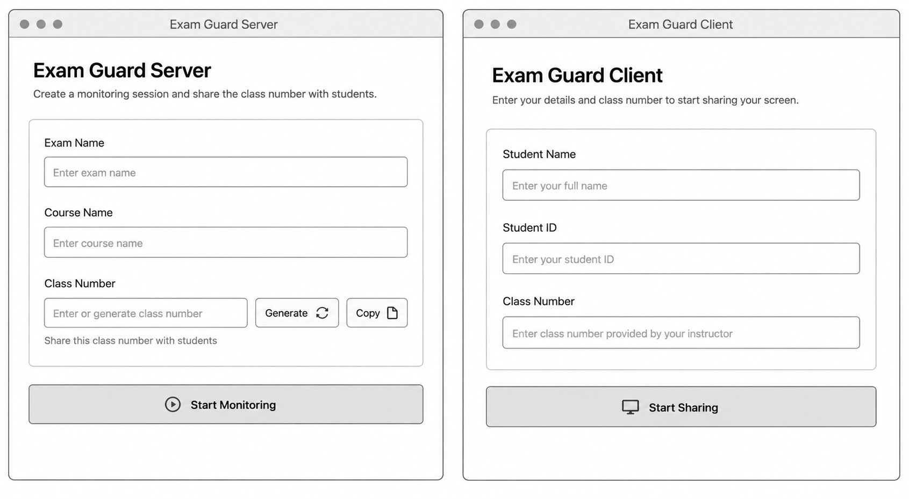

# Exam Monitor Cross-Platform MVP

This workspace ports the Swift app flow to a Rust core plus Tauri desktop shells.

The MVP keeps the same product model:

- Server app creates a monitoring room.
- Room number is used as the network port.
- Client app joins with student name, student ID, and room number.
- Client sends identity first.
- Client captures the screen periodically and sends JPEG frames.
- Server dashboard displays connected students and latest screen frames.

## Layout

- `crates/exam-monitor-core`: shared protocol, TCP/UDP networking, screen capture, client runtime, server runtime.
- `apps/client`: Tauri student client.
- `apps/server`: Tauri proctor server.
- `tools/stress-clients`: synthetic TCP clients for load testing the server app.

## Protocol

Packets intentionally match the Swift prototype:

```text
"HE" magic bytes + UInt16 packet type + UInt32 payload length + payload
```

Packet types:

- `0`: name payload as `name|studentID`
- `1`: message payload, reserved for later
- `2`: JPEG screen frame

## Local Run

Rust is required before this can run:

```bash
cd cross_platform/apps/server
npm install
npm run tauri dev
```

In another terminal:

```bash
cd cross_platform/apps/client
npm install
npm run tauri dev
```

Use the same 4-digit room number in both apps.

## How Discovery Works

The client finds the server in three ways, in order:

1. Direct connection to a manually entered server IP (the optional "Server IP" field in the client).
2. UDP probe: the client broadcasts `discover` to every local subnet's broadcast address on the room port; the server replies `server` directly to the client.
3. Server beacon: the server broadcasts `server` every 2 seconds to the same addresses, and the client listens on the room port.

The teacher's IP for manual entry is shown by `ipconfig` (Windows) or System Settings → Network (macOS).

## Network Troubleshooting

If the client stays on "Looking for the server...":

- **Windows Firewall (client and server on Windows):** the first launch shows a firewall prompt — click "Allow access". If it was dismissed, allow the app under Windows Security → Firewall & network protection → Allow an app through firewall, for both Private and Public profiles.
- **macOS Local Network permission (macOS 15+):** the first launch asks for Local Network access — click "Allow". Re-enable later under System Settings → Privacy & Security → Local Network.
- **macOS firewall:** if enabled, allow incoming connections for the server app when prompted.
- **Both machines must be on the same network/subnet.** Guest Wi-Fi and networks with "AP/client isolation" block device-to-device traffic entirely — on such networks, use the manual Server IP field; if that also fails, the network itself is blocking the connection.

## Build Installers

The Tauri bundle step is enabled for both desktop apps. Build each app from its package folder:

```bash
cd cross_platform/apps/server
npm run build:mac-app
```

```bash
cd cross_platform/apps/client
npm run build:mac-app
```

Build outputs are written under:

```text
cross_platform/target/release/
cross_platform/target/release/bundle/
```

For full installer packages, use `npm run build` on the target platform.

Expected user-facing packages by platform:

- macOS: `.app` and `.dmg`
- Windows: `.msi` or `.exe`
- Linux: `.deb`, `.rpm`, or `.AppImage`

For release distribution, build on each target OS or use CI runners for each platform. A macOS machine should build the macOS package, a Windows runner should build the Windows package, and a Linux runner should build the Linux package.

This repo includes a GitHub Actions workflow at `.github/workflows/desktop-builds.yml`. Every branch push builds both apps on macOS, Windows, and Linux, then uploads downloadable workflow artifacts. Pushing a tag like `v0.1.0` also creates or updates a GitHub Release and uploads the packaged app assets to that release.

Before sharing with real users, add platform signing/notarization:

- macOS: Developer ID signing and notarization.
- Windows: code-sign the installer/executable.
- Linux: publish checksums and package metadata.

## Stress Test

Start the server app and create a room first. Then run synthetic clients against that room number:

```bash
cd cross_platform
cargo run -p stress-clients -- --host 127.0.0.1 --port 1234 --clients 20 --fps 5 --seconds 60
```

The tool sends the same protocol as the real client: one identity packet followed by JPEG frame packets.

## Class Number Wireframe



## App Icon

The shared app icon source is `assets/exam-guard-icon.png`. Generated app icon assets live in each Tauri app's `src-tauri/icons` directory.

Regenerate icon assets with:

```bash
python3 cross_platform/tools/generate_app_icons.py
```
